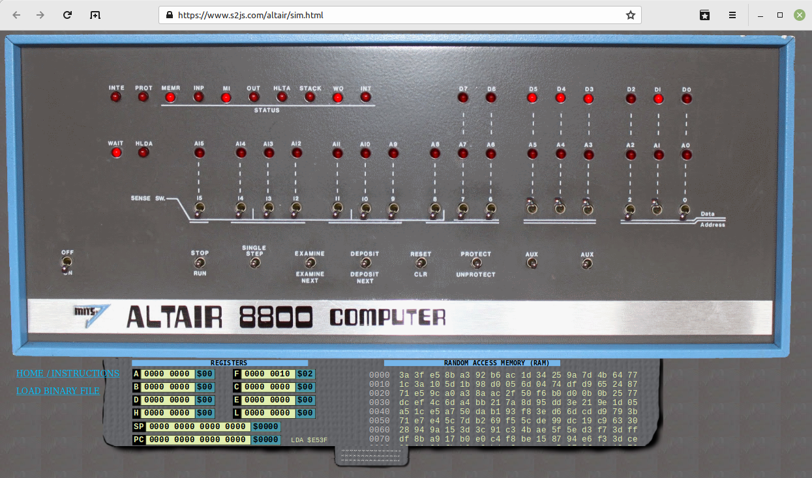
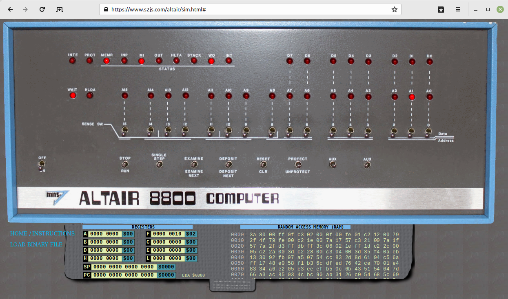
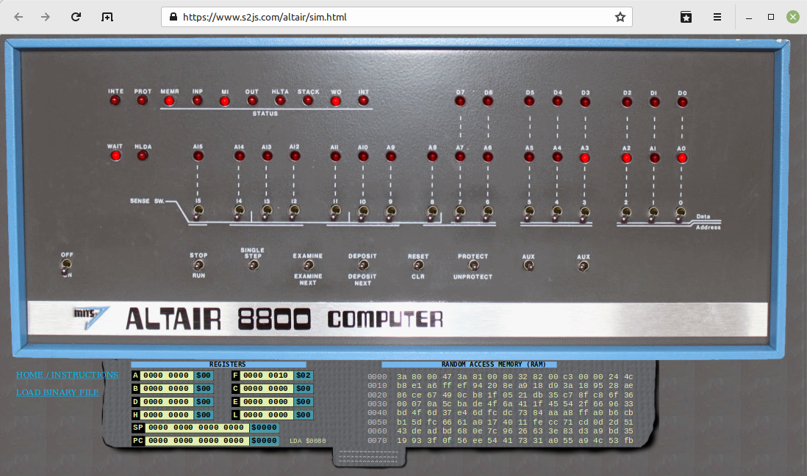
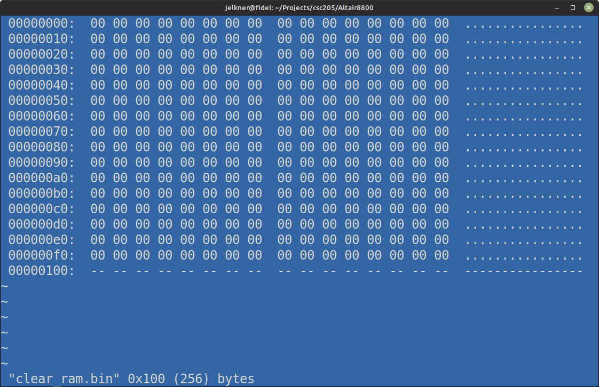
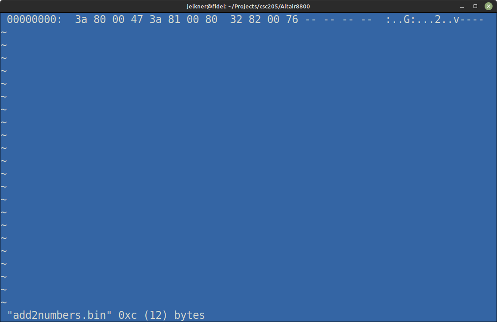

# The Sample Program

A sample program that adds two numbers is first discussed in [G. A Simple
Program](https://ubuntourist.codeberg.page/Altair-8800/part-1.html#g-a-simple-program),
and then [B. Loading a Sample
Program](https://ubuntourist.codeberg.page/Altair-8800/part-3.html#b-loading-a-sample-program)
provides step-by-step instructions on how to run it.

My task will be to walk students through this process using the
[online Altair 8800 simulator](https://www.s2js.com/altair/sim.html).

## The Switches and Lights UI

### Step 1

Turn on the simulator with the ``ON/OFF`` switch, move the ``RESET/CLR`` switch
to ``RESET``, and show the memory.

### Step 2

Set the ``D5``, ``D4``, ``D3``, and ``D1`` switches to the up (1) position,
then move the ``DEPOSIT/DEPOSIT NEXT`` switch to ``DEPOSIT``. Success will be
indicated if the ``D5``, ``D4``, ``D3``, and ``D1`` lights come on.

Look carefully at the ``RANDOM ACCESS MEMORY (RAM)``.  What changed between
steps 1 and 2?  Explain the change.

### Step 3

Set ``D7`` to the up (1) position, and ``D6`` through ``D0`` to the down (0)
position and press the ``DEPOSIT/DEPOSIT NEXT`` switch in to ``DEPOSIT NEXT``.
Then set ``D7`` to 0 (down), so that all the ``D`` switches are in the 0
position, and press the ``DEPOSIT NEXT`` switch again. At this point your
emulator screen should look like this:

The first three bytes of **RAM** should contain ``3a 80 00``.  Explain *in
detail* why this is so.

### Step 4

Key in the rest of the instructions from
[Part 3 B. Loading a Sample
Program](https://ubuntourist.codeberg.page/Altair-8800/part-3.html#b-loading-a-sample-program)
from the [Altair 8800 Operator's
Manual](https://ubuntourist.codeberg.page/Altair-8800/). When finished, the
first 14 [bytes](https://en.wikipedia.org/wiki/Byte) of the **RAM** should
look like this:

## Speeding Things Up with [Hexer](https://gitlab.com/hexer/hexer)

At this point the manual states that it is time to load the program data (the
two numbers to be added) and run the program. Since we'll be using the online
[Altair Simulator](https://www.s2js.com/altair/sim.html), and since our main
learning goals at this stage are:

1. To develop facility converting among
   [binary](https://en.wikipedia.org/wiki/Binary_number),
   [octal](https://en.wikipedia.org/wiki/Octal), and
   [hexadecimal](https://en.wikipedia.org/wiki/Hexadecimal) representations of
   numbers.
2. To start becoming familiar with the architecture of the Altair 8800,
   specifically how a computer program and its data are written to the
   computer's memory before the program is run.

We would like to address two problems that interfere with the learning goals:

1. The visual noise caused by having random (garbage) values in the simulator's
   RAM at startup.
2. The tedious and error prone process of entering the program by activating
   switches.

The solution to both these problems is provided by the simulator's support for
uploading binary files to set the condition of the virtual computer's memory.

Here is what we'll do:

1. Use [Hexer](https://devel.ringlet.net/editors/hexer/) to create a binary
   file named ``clear_ram.bin`` to set all the simulator's RAM to 0.

   

2. Again using Hexer, create ``add2numbers.bin`` to load the sample program.
   Replace the ``JMP`` instruction (``c3 00 00``) with a ``HLT`` instruction
   (``76``).  (*since it irks me to have the program looping repeatedly
   over a simple calculation when we only want it to happen once*).

   

These two files can be uploaded to the simulator in sequence using the ``LOAD
BINARY FILE`` link that appears when the simulator is turned on.

The data can now be set using the ``EXAMINE/EXAMINE NEXT`` and
``DEPOSIT/DEPOSIT NEXT`` switches.  Later, we can use a third binary file to
set the data, but students should experience this process at least a few times
using the switches.
