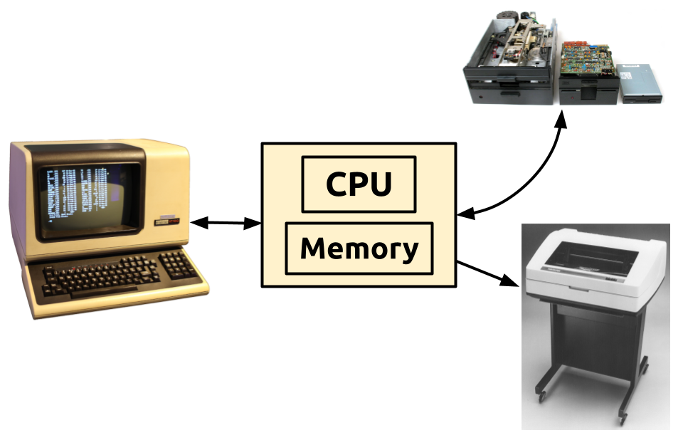

# CP/M Assembly Language Programming Notes

Page numbers in the notes that follow refer to *CP/M Assembly Language
Programming* by Ken Barbier published by Prentice-Hall in 1983.


## Terms

### Terminal
> The main input/output hardware on the computer, consisting of a keyboard
> and a video display. Synonyms include **CON**, **TTY**, **console**,
> **CRT**, **screen**, and **VDT** (page 8).


## Microcomputer Hardware Components




## CP/M Assembly Program Development Workflow

1. Use your favorite text editor (vim would be a great choice ;-) to edit
   the source file. Let's call it <code>MYPROG.ASM</code>.
2. Move <code>MYPROG.ASM</code> to the same directory from which
   <code>simh</code> will be run.
3. Start [Peter Schorn's SIMH environment](https://schorn.ch/altair.html) with
   CP/M and extra data disks configured.
4. Change to the virtual disk where you want your assembly programs to be.
   Let's assume it's <code>C:</code>.
5. Use the <code>R.COM</code> utility to read <code>MYPROG.ASM</code> 
   into your current CP/M virtual disk: 
   ```
   C>R MYPROG.ASM
   ```
6. Assemble your program with: 
   ```
   C>ASM MYPROG
   ```
   This will generate <code>MYPROG.PRN</code> and <code>MYPROG.HEX</code>.
7. Generate a CP/M executable program with:
   ```
   C>LOAD MYPROG
   ```
   which creates the executable <code>MYPROG.COM</code> file.
8. Run your program with:
   ```
   C>MYPROG
   ```
9. If in steps 6 or 8 you discover errors in your program, use the
   <code>W.COM</code> utility to write any of the files you need out to the
   host environment for editing and debugging:
   ```
   C>W MYPROG.PRN
   C>W MYPROG.HEX
   ```
   then read your *hopefully* fixed <code>MYPROG.ASM</code> in again and
   rinse, lather, and repeat.
