# Installing a Minimalist FreeDOS Using QEMU
---
## Steps:
1. Create a virtual hard drive image where FreeDOS will live
2. Boot from media with FreeDOS (CD image)
3. Partition virtual hard drive
4. Reboot to CD image
5. Format and install FreeDOS on virtual hard disk
---
### Step 1: Create a Virtual Hard Disk Image
+++
#### Use qemu-img to Create Disk Image
1. Create an 80 megabyte hard drive (plenty for our purposes)
2. Use [QEMU](https://www.qemu.org/)'s ```qemu-img``` program
3. Run:
```
$ qemu-img create drive_c.img 80M
```
---
### Step 2: Boot from FreeDOS Live CD
+++
#### To Boot from FreeDOS Live CD:
1. Make sure these are in the current dirctory:
     * CD image file (```FD13LIVE.iso```)
     * hard disk image (```drive_c.img```)
2. Start the system:
```
$ qemu-system-i386 -m 4 -k en-us -rtc base=localtime -device cirrus-vga -hda drive_c.img -cdrom FD13LIVE.iso -boot order=d
```
---
### Step 3: Setup Virtual Hard Drive
+++
#### Boot to the welcome screen
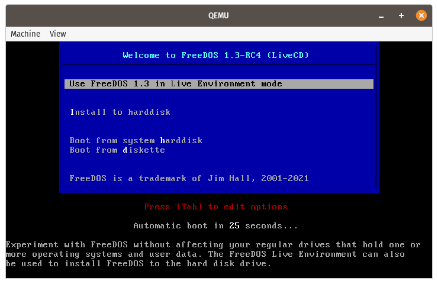
+++
####  Partition the Disk
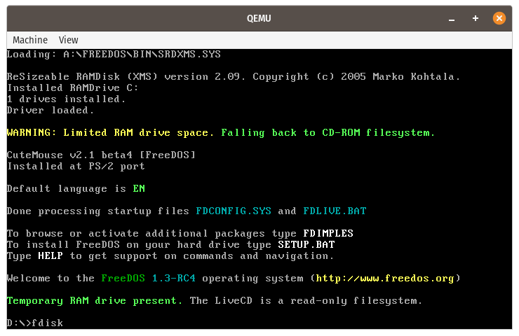
+++
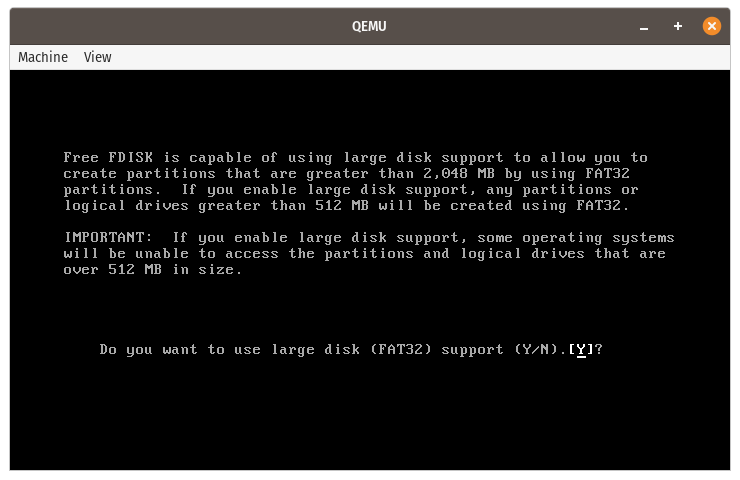
+++
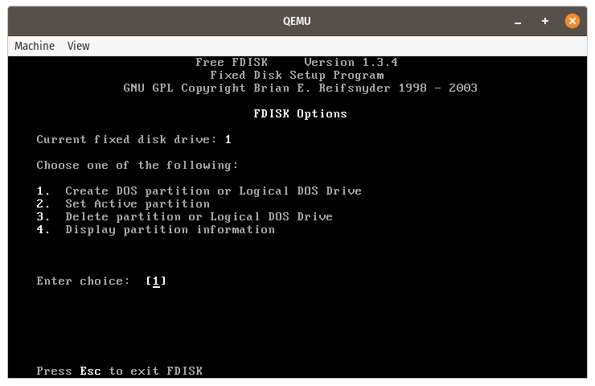
+++
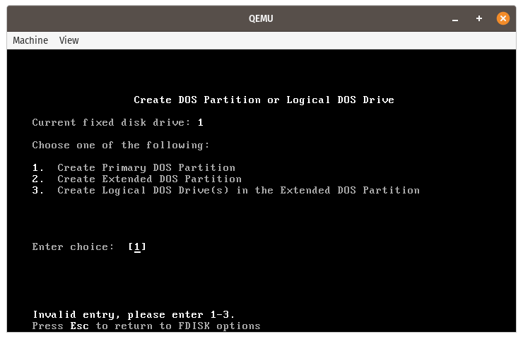
+++
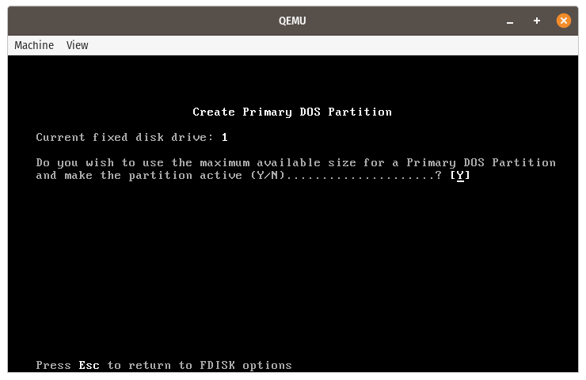
+++
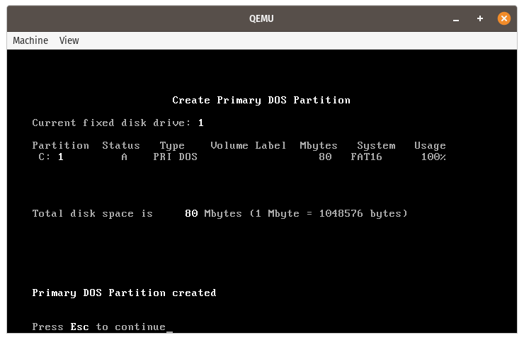
+++
#### Set Active Partition
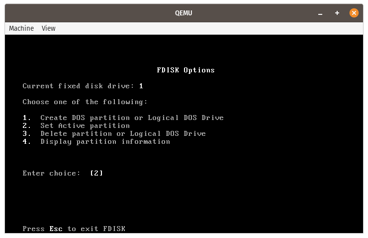
+++
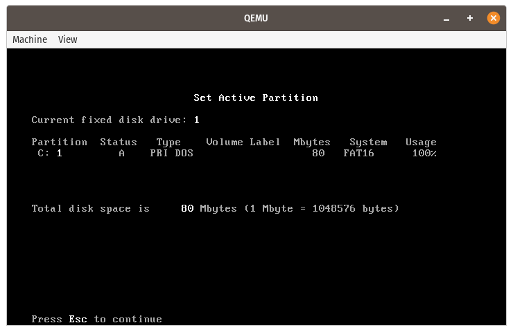
+++
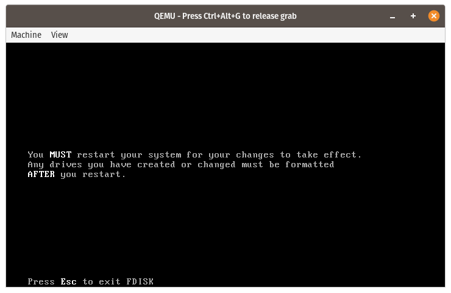
---
### Step 4: Reboot to CD image
* Select *Machine -&gt; Quit* from QEMU menu (or Ctrl+Alt+Q)
---
### Step 5: Format and Install FreeDOS 
+++
#### Run format c:
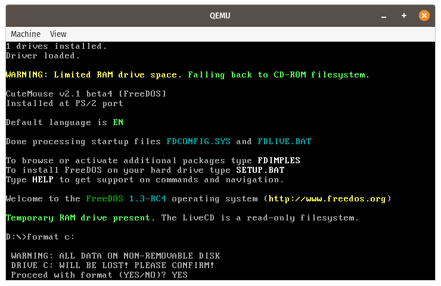
+++
#### Enter Volume Label

+++
#### Finished Formatting 
+++
#### Install FreeDOS on Virtual Hard Disk 
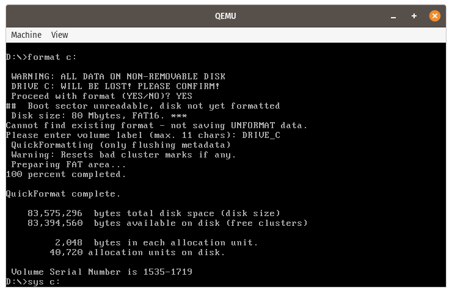
+++
#### System Transferered - FreeDOS Installed 
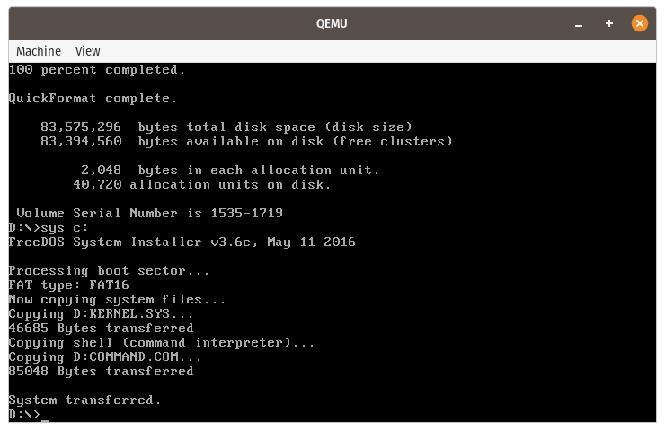
---
### Reboot from Virtual Hard Drive
```
qemu-system-i386 -m 4 -k en-us -rtc base=localtime -device cirrus-vga -hda drive_c.img -boot order=c
```
+++
#### It Works!
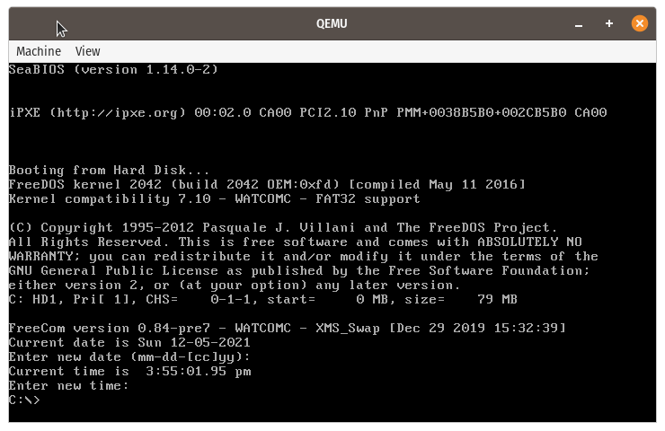
+++
#### But There's Not Much Here
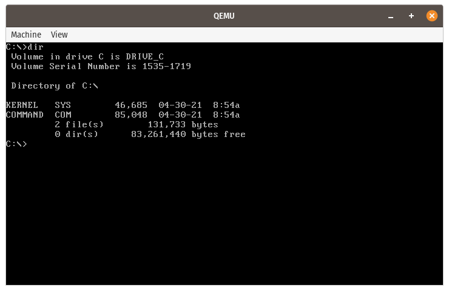
---
### What's Next?

We need a way to "communicate" with the system.

* There is no networking.
* There isn't even [sneaker net](https://en.wikipedia.org/wiki/Sneakernet).

What can we do?
---
## Next Time:
1. Creating a second virtual hard drive (for data) in the host OS file system.
2. Installing useful tools --- like an editor, for starters!
3. Doing useful things --- like playing games?
